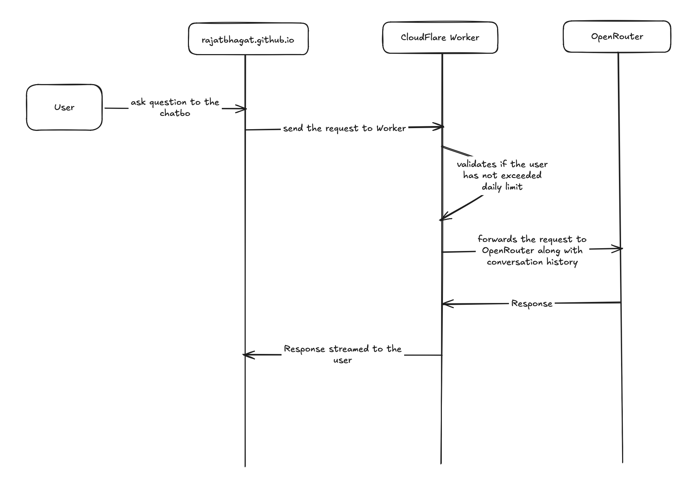

## TL;DR

[Ask My Resume](https://rajatbhagat.github.io/ask-my-resume/) is an LLM-based serverless chatbot designed to answer questions about my resume — education, work, projects and skills. The design relies on a serverless Worker provided by Cloudflare, which sends the user's request to OpenRouter to get a response from one of the chosen models. The bot also maintains some limited conversation context so the conversation can flow better rather than being a strict question-and-answer format. The setup and chosen technologies ensure that running the bot costs nothing, and it has guardrails to mitigate exploitative usage.

## Architecture overview

The architecture is pretty simple. A standard user request follows this flow:

- User asks a question on the UI (floating widget / ask-my-resume page)
- The request, along with the user's recent conversation history, is sent to the Cloudflare Worker
- The Worker validates the message and checks it against the rate limits, then forwards the request to OpenRouter
- OpenRouter runs the LLM and streams a response back, which is shown to the user

## Components

### Frontend and UI (Astro island)

The UI is built with Astro and written in TypeScript. I owned the user-experience decisions — the floating widget and the dedicated `/ask-my-resume` page sharing a single component, incremental streaming of answers as they arrive, the model picker, and the mobile layout — and paired with Claude Code to implement and iterate on them.

### Cloudflare Worker

github.io websites are meant to be simple static pages, and the repository holding this website's code has to be a public repository accessible by everyone. That means it can't hold any sort of secret, including the OpenRouter API key. This was the main reason for creating a Cloudflare Worker: it can hold the API key safely and talk to the OpenRouter API to invoke the LLMs.

### LLM via OpenRouter

OpenRouter provides a whole host of models to choose from. I chose the three below, which seem to provide reliable and accurate output with a large token and parameter capacity:

- nvidia/nemotron-3-ultra-550b-a55b:free
- openai/gpt-oss-20b:free
- google/gemma-4-26b-a4b-it:free

The main drawback of using free models is the account-wide 50 requests/day limit. To keep any one visitor from exhausting that, a single user starts getting `Rate Limit Exceeded` messages after 16 questions in a day. Realistically a recruiter wouldn't go that far, so this rarely comes up. Adding OpenRouter credits or switching to a low-cost paid model would lift the daily cap.

### Corpus and System Prompt

The initial prototype only used my resume as the basis. Later I expanded on every job role and my duties within it, and stored a summary of that in the corpus. The entire corpus is approximately 3,000 tokens — small enough that context size isn't a concern. The initial idea was to build a RAG-based implementation to avoid consuming a lot of input tokens from the get-go. The current implementation includes the whole corpus in the system prompt, and the prompt also adds guardrails: it instructs the model to answer only from the corpus and to politely decline off-topic questions. The next step would be a RAG-based solution — but since the corpus is so small, RAG is unlikely to make a significant difference, so it stays a learning exercise for later rather than a necessity.

### Conversation memory

Maintaining conversation history was a significant problem to overcome. Without it, the bot would be less conversational and more of a question-and-answer page. History is kept by storing the previous questions and the bot's answers in the browser and sending them along with each new request. The Cloudflare Worker only uses the last 5 messages when building the prompt for the LLM — again, a measure to avoid filling up the token budget. Because the history lives in each visitor's browser, concurrent users never share context, and no conversation data is stored on any server.

## Key design decisions & tradeoffs

- **Embedding corpus in system prompt over RAG (for now).** With a ~3k-token corpus, stuffing the whole thing into the system prompt is simpler and cheaper than standing up embeddings and a vector store. RAG is the natural next step and a good learning exercise, but it wouldn't measurably improve answers at this corpus size.
- **Free models over paid.** Zero running cost was a hard goal, and the free models handle resume questions well. The cost of that choice is the 50 requests/day account cap, which the per-IP rate limit exists to protect.
- **Per-IP rate limiting over an off-topic gate.** A pre-filter that classifies every question before answering would add latency to every legitimate request, to defend against abuse that is hypothetical, free, and self-healing (the quota resets daily). I chose to bound the damage with a per-IP daily limit instead, and left the gate as an option to revisit if real abuse shows up.
- **Client-held conversation history over server storage.** Keeping history in the browser keeps the Worker stateless, sidesteps the problem of identifying anonymous users, and means I never store anyone's conversation.

## Security & abuse model

Everything arriving at the Worker is treated as untrusted, and a few layers handle that:

- **CORS** restricts which origins a browser will let call the Worker, so another website's front-end can't drive the bot through its visitors' browsers.
- **Per-IP rate limiting** (in Workers KV) caps any single IP's daily questions, protecting the shared request budget.
- **System Prompt** — the system prompt tells the model to answer only from the corpus and to ignore instructions embedded in user input, and the Worker only accepts `user`/`assistant` roles in replayed history, so a client can't smuggle in a fake `system` message.
- **Escape-first rendering** — model output is rendered as untrusted content (HTML is escaped, links are scheme-checked), because a prompt-injected model is effectively untrusted input inside my page.

The honest gap I live with for now is that the Worker URL is public. CORS only binds browsers, so a non-browser client (curl, a script) can call the endpoint directly and spend requests. Real auth isn't a fix here — the whole point is to serve anonymous recruiters, who can't be asked to log in. The realistic tool, if abuse ever materializes, is a humanness challenge like Cloudflare Turnstile. Given that the models are free and the daily cap self-heals, the rate limiter is a reasonable place to stop for now.

## Cost & scaling

The total cost of building this entire project with Claude Code (using the Fable 5 model) was about $2, per the statusline in my Claude Code session. The running cost is $0 — the models and the Cloudflare / GitHub Pages tiers are all free. The one bottleneck is the 50 requests/day OpenRouter cap, which a small amount of credit or a low-cost paid model would remove.

