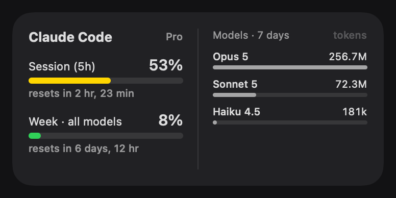

A native macOS WidgetKit widget (small, medium and large) plus a menu bar gauge showing how much of my Claude Pro plan I've used: the 5-hour session limit and the weekly limit with live reset countdowns, and a per-model breakdown — Opus, Sonnet, Haiku — of tokens over the last 7 days. Widget extensions are sandboxed and can't read a keychain or shell out, so a small unsandboxed menu bar app does the collecting: it reads Claude Code's own OAuth token from the keychain, asks the same endpoint the `/usage` command uses, sums per-model tokens from the local transcripts (deduplicating the streamed chunks that repeat every usage block — over half the lines), and hands the widget a snapshot. The hard part was doing it with no Apple developer account: App Groups, the normal app-to-widget bridge, need a provisioning profile, so the app writes straight into the widget's sandbox container instead, and ad-hoc signing quietly injects a debugger-attach entitlement into release builds that had to be switched off since the token lives in the app's memory. The screenshots in the README are rendered from the real SwiftUI views with `ImageRenderer`, so they never go stale.
